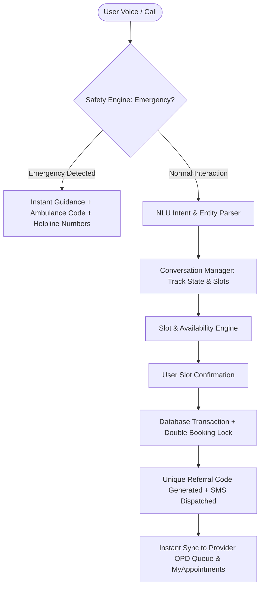
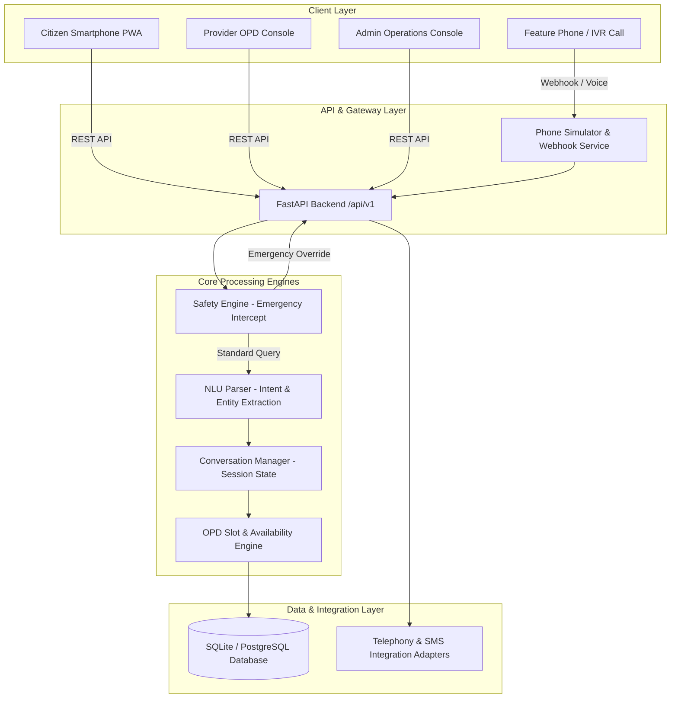

# JanSethu AI

> **Voice-first healthcare assistance for rural and underserved communities.**

---

## 📌 Smart India Hackathon (SIH) 2026 Information

| Attribute | Details |
| --- | --- |
| **Event** | Smart India Hackathon 2026 |
| **Problem Statement ID** | 26133 |
| **Team Name** | Cipher-404 |

---

## 🎯 Problem Statement

In rural and underserved regions across India, millions of citizens face severe hurdles when seeking primary healthcare:
- **Language & Literacy Barriers**: Complex mobile applications and online portals rely heavily on text literacy, excluding citizens who communicate primarily through regional spoken dialects.
- **Lack of Information & Unpredictable OPD Availability**: Villagers often travel long distances to Primary Health Centres (PHCs) or Community Health Centres (CHCs) only to find doctors absent or OPD queues closed.
- **Overcrowded Facilities & Long Wait Times**: The lack of an accessible appointment booking mechanism leads to queue congestion and delayed care.
- **Emergency Triage Delay**: Critical situations require immediate routing to nearby emergency-capable facilities, which traditional manual search fails to provide instantly.

---

## 💡 Solution

**JanSethu AI** is an inclusive healthcare access and routing platform that bridges the digital, linguistic, and geographical divide. 

It provides dual accessibility channels:
1. **Interactive Voice & IVR Hotline**: Citizens can call a phone line (simulated via Web Voice Hotline or integrated IVR) and speak naturally in their native language (Hindi, Marathi, English) to search for nearby doctors, check OPD availability, and book appointments.
2. **Smartphone Progressive Web App (PWA)**: A modern responsive web app for citizens, healthcare providers, and administrators to discover facilities, manage OPD consultation queues, and maintain doctor schedules.

Both channels converge on a single FastAPI backend with dynamic slot management, double-booking prevention, and real-time cross-channel queue synchronization.

---

## ✨ Key Features (Implemented)

- 🗣️ **Voice & IVR Hotline Channel**: Hands-free spoken interaction with continuous speech recognition, text-to-speech feedback, conversational barge-in support, and DTMF keypad input fallback.
- 🌐 **Multilingual Support**: Prompts and conversation management configured for Hindi (`HI`), Marathi (`MR`), and English (`EN`).
- 🏥 **Healthcare Facility Discovery**: Search PHCs, CHCs, and hospitals using location pincodes, districts, or Haversine GPS radius search.
- 📅 **Dynamic OPD Slot Engine**: Real-time 30-minute appointment slot calculation derived from doctor recurring weekly availability schedules, doctor leave exceptions, and existing bookings.
- 🎟️ **Instant Appointment Booking & Referral Tickets**: Automated booking with unique referral codes (`JS-2026-XXXXXX`), appointment status tracking, and cancellation capabilities.
- 🚨 **Emergency Triage & Preemption**: High-priority keyword detector (`SafetyEngine`) that intercepts emergency phrases (e.g., severe chest pain, breathing difficulty, accidents) to immediately return safety guidance, simulated ambulance dispatch codes (`AMB-MOCK-XXXXX`), and facility emergency contacts.
- 🩺 **Provider OPD Queue Dashboard**: Facility doctor console to track live queues, manage patient visit lifecycle (`BOOKED` ➔ `IN_PROGRESS` ➔ `COMPLETED` / `NO_SHOW` / `CANCELLED`), and register leave exceptions.
- ⚙️ **Admin Operations Console**: Onboard new facilities and doctors, update emergency directories, and monitor audit trails and telephony/SMS logs.
- 🔌 **Provider-Neutral Integration Layer**: Pluggable backend architecture with zero-cost mock adapters for offline local execution alongside production adapters for Twilio/Exotel (voice) and MSG91 (SMS).

---

## 🔄 How It Works

### 1. Spoken Voice / IVR Call Workflow


### 2. Smartphone PWA Workflow
1. Patient selects location/pincode or searches by medical specialty.
2. Platform computes open 30-minute OPD slots for the selected date.
3. Patient completes booking; a unique referral ticket is generated.
4. Patient views referral ticket under **My Appointments**.
5. Healthcare provider views the patient's token in real time under the **Provider Dashboard**.

---

## 🛠️ Technology Stack

| Layer | Technology | Role & Purpose |
| --- | --- | --- |
| **Frontend UI** | React 18, Vite 5, Tailwind CSS v3 | Responsive citizen PWA, Provider OPD console, and Admin dashboard |
| **Voice & Speech** | Browser Web Speech API | Speech recognition (`SpeechRecognition`) and voice synthesis (`SpeechSynthesisUtterance`) with barge-in |
| **UI Components & Routing** | Lucide React, React Router v7 | Modern UI iconography and single-page app navigation |
| **Backend API** | Python 3.10+, FastAPI, Uvicorn | High-performance asynchronous REST API server |
| **Database & ORM** | SQLite / PostgreSQL, SQLAlchemy 2.0 ORM | Relational data persistence, slot calculation, and Alembic migrations |
| **Authentication & Security** | PyJWT, Passlib (bcrypt), Pydantic v2 | User authentication, password hashing, and strict schema validation |
| **Automated Testing** | Pytest, AnyIO | Async unit and integration test runner (539+ passing tests) |
| **Adapters & Integrations** | Custom Provider Adapters | Abstract integration layer for Telephony (Twilio/Exotel) and SMS (MSG91) |
| **Deployment / Container** | Docker, Docker Compose | Containerization support for FastAPI backend and PostgreSQL database |

---

## 🏗️ System Architecture



---

## 📂 Project Structure

```
JanSethu AI/
├── backend/
│   ├── alembic/                      # Alembic DB migration scripts
│   ├── app/
│   │   ├── api/v1/endpoints/        # FastAPI endpoints (auth, facilities, doctors, appointments, telephony, etc.)
│   │   ├── core/                    # Security, JWT, rate limiter, core config, prompts
│   │   ├── database/                # SQLAlchemy session & base setup
│   │   ├── integrations/            # Provider adapters (Telephony & SMS: Dev, Twilio, Exotel, MSG91)
│   │   ├── models/                  # SQLAlchemy ORM entities (13 tables)
│   │   ├── repositories/            # Database query repository layer
│   │   ├── schemas/                 # Pydantic request/response validation schemas
│   │   ├── services/                # SafetyEngine, NLU IntentParser, ConversationManager, Slot Engine
│   │   └── tests/                   # Pytest automated test suite
│   ├── scripts/                     # Data seeding (seed.py) & test verification scripts
│   ├── alembic.ini                  # Migration settings
│   ├── Dockerfile                   # Backend Docker configuration
│   └── requirements.txt             # Python backend dependencies
├── frontend/
│   ├── public/                      # Static assets & PWA manifest
│   ├── src/
│   │   ├── components/              # Layout components (Navbar, Footer)
│   │   ├── context/                 # AuthContext authentication state provider
│   │   ├── pages/                   # Application pages (Home, Facilities, PhoneSimulator, etc.)
│   │   │   ├── admin/               # Admin console components
│   │   │   └── provider/            # Provider OPD queue dashboard
│   │   ├── services/                # Axios API client modules
│   │   ├── App.jsx                  # Main route definitions
│   │   └── main.jsx                 # React client entry point
│   ├── package.json                 # Frontend dependencies & scripts
│   └── vite.config.js               # Vite build configuration
├── docs/                            # Presentation scripts, architecture notes, & SIH documentation
├── docker-compose.yml               # Docker Compose file for PostgreSQL & FastAPI
├── jansethu_v2.db                   # Local SQLite development database
└── README.md                        # Platform documentation
```

---

## ⚡ Setup & Installation

### Prerequisites
- **Python**: 3.10 or higher
- **Node.js**: v18 or higher (with `npm`)

### 1. Backend Setup

```bash
# Navigate to backend directory
cd backend

# Install dependencies
pip install -r requirements.txt

# Create local environment configuration file
cp .env.example .env

# Run database migrations
python -c "from alembic.config import main; main()" upgrade head

# Seed sample healthcare data (Facilities, Doctors, Schedules, Appointments)
python scripts/seed.py

# Start the FastAPI backend server
python -m uvicorn app.main:app --reload --port 8000
```

- **Health Check Endpoint**: [http://localhost:8000/api/v1/health](http://localhost:8000/api/v1/health)
- **Interactive OpenAPI Documentation**: [http://localhost:8000/docs](http://localhost:8000/docs)

---

### 2. Frontend Setup

```bash
# Open a new terminal and navigate to frontend directory
cd frontend

# Install dependencies
npm install

# Start Vite development server
npm run dev
```

- **Citizen PWA Application**: [http://localhost:5173](http://localhost:5173)
- **Voice Hotline Simulator**: [http://localhost:5173/phone-simulator](http://localhost:5173/phone-simulator)
- **Provider OPD Dashboard**: [http://localhost:5173/provider](http://localhost:5173/provider)
- **Admin Console**: [http://localhost:5173/admin](http://localhost:5173/admin)

---

### 3. Running Automated Tests

```bash
cd backend
python -m pytest app/tests/ -v
```

---

### 4. Running with Docker Compose (Optional)

```bash
docker-compose up --build
```

---

## 🔐 Environment Variables

The project uses environment variables for configuration. Standard defaults are configured for local development.

| Variable | Default Value (Development) | Purpose |
| --- | --- | --- |
| `APP_ENV` | `development` | Application environment mode |
| `DEBUG` | `true` | Enables verbose debug logs |
| `SECRET_KEY` | `your_secret_key_here` | Key used for signing JWT access tokens |
| `ACCESS_TOKEN_EXPIRE_MINUTES` | `1440` | JWT token validity duration |
| `DATABASE_URL` | `sqlite:///./jansethu_v2.db` | Database connection URL (SQLite / PostgreSQL) |
| `CORS_ORIGINS` | `http://localhost:5173,http://localhost:3000` | Whitelisted cross-origin origins |
| `TELEPHONY_PROVIDER` | `development` | Provider mode (`development`, `twilio`, `exotel`, `vonage`) |
| `SMS_PROVIDER` | `development` | SMS provider mode (`development`, `msg91`, `twilio`) |
| `STT_PROVIDER` | `mock` | Speech-to-Text adapter mode |
| `TTS_PROVIDER` | `mock` | Text-to-Speech adapter mode |
| `LOCATION_PROVIDER` | `mock` | Geocoding adapter mode |
| `LLM_PROVIDER` | `development` | NLU parser mode (`development`, `openai`, `gemini`, `ollama`) |
| `TWILIO_ACCOUNT_SID` | `your_twilio_account_sid` | Twilio Account SID placeholder |
| `TWILIO_AUTH_TOKEN` | `your_twilio_auth_token` | Twilio Auth Token placeholder |
| `EXOTEL_ACCOUNT_SID` | `your_exotel_account_sid` | Exotel Account SID placeholder |
| `MSG91_AUTH_KEY` | `your_msg91_auth_key` | MSG91 Auth Key placeholder |

> ⚠️ **Security Notice**: Never commit real secret keys or API tokens to version control. Use `.env` for local configuration.

---

## 📽️ Demo & Resources

- 🎬 **YouTube Prototype Demo**: *[Link Placeholder — To be added]*
- 📁 **Project Drive & Slides**: *[Link Placeholder — To be added]*
- 🌐 **Live Deployment**: *Local execution instructions available above under Quick Start*

---

## 📊 Prototype Status

- **Data Source**: The current prototype operates using **sample / synthetic healthcare data** covering facilities (PHCs, CHCs, hospitals), doctors, OPD schedules, and patient profiles across representative districts (e.g., Baramati, Pune, Satara, Solapur, Ahmednagar).
- **Execution Mode**: Runs locally in `development` provider mode without requiring external paid API keys or active telecom accounts.

---

## ⚠️ Safety & Disclaimer

> [!IMPORTANT]
> **JanSethu AI is a healthcare navigation, slot booking, and facility assistance platform — NOT a diagnostic or treatment system.**
> 
> - JanSethu AI does **not** provide medical diagnosis, clinical treatment advice, or prescriptions.
> - The emergency preemption feature provides routing guidance and emergency contact numbers based on predefined safety rules.
> - In case of a real medical emergency, users must contact official emergency services (e.g., **108 / 112** in India) or immediately visit the nearest medical facility.

---

## 🔮 Future Scope

*(Planned future enhancements beyond the current prototype implementation)*

- **Live Telecom IVR Integration**: Deployment on cloud telephony providers (Exotel / Twilio) using official DLT-registered SMS routes (MSG91).
- **Expanded Dialect NLU**: Fine-tuned voice models for additional regional languages and rural dialects (e.g., Bhojpuri, Gujarati, Tamil, Telugu, Bengali).
- **PWA Offline Sync**: Service worker background synchronization for storing appointment requests when network connectivity is lost.
- **ABDM / ABHA Integration**: Seamless authentication and health record linking via Ayushman Bharat Digital Mission (ABHA ID).
- **Multi-Channel Expansion**: Extending conversational booking to messaging platforms such as WhatsApp Business API.

---

## 👥 Team

- **Team Name**: Cipher-404
- **Hackathon**: Smart India Hackathon 2026
- **Problem Statement ID**: 26133
